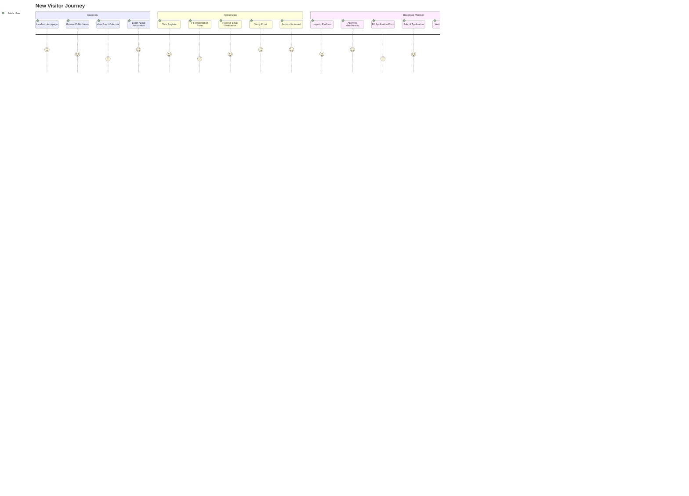
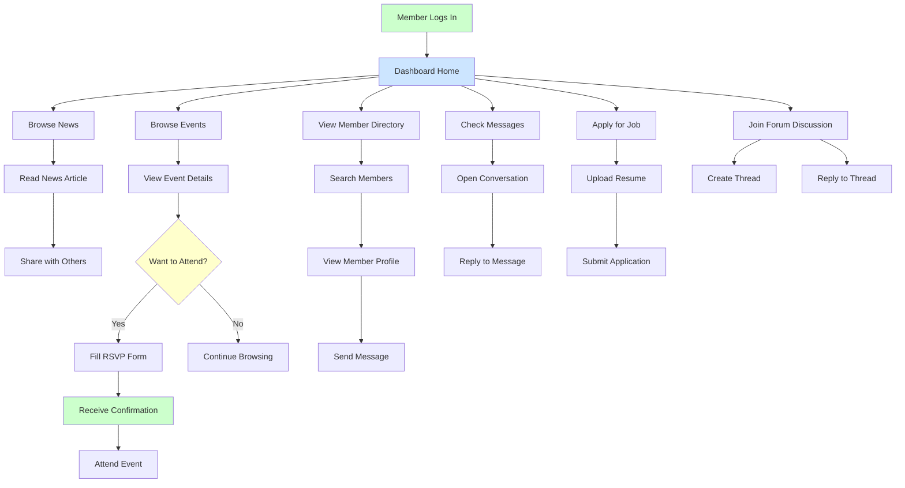
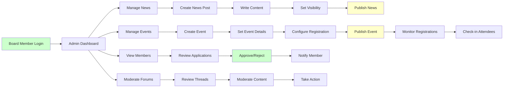
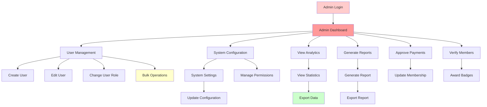

# 🗺️ ASCAI Platform - User Journey Maps

Visual journey maps for different user personas interacting with the platform.

---

## 👤 Persona 1: New Visitor (Public User)

### Journey: Discovering and Joining the Association



---

## 👤 Persona 2: Active Member

### Journey: Engaging with Platform Features



---

## 👤 Persona 3: Board Member

### Journey: Managing Content and Events



---

## 👤 Persona 4: Administrator

### Journey: System Administration



---

## 🎯 Key Touchpoints

### Registration & Onboarding
```
1. Landing Page → 2. Registration Form → 3. Email Verification → 4. Login → 5. Dashboard
```

### Member Application Process
```
1. Application Form → 2. Submission → 3. Admin Review → 4. Approval Email → 5. Member Access
```

### Event Participation
```
1. Browse Events → 2. View Details → 3. Register → 4. Confirmation → 5. Attend Event
```

### Content Consumption
```
1. Browse News → 2. Filter/Search → 3. Read Article → 4. Share/Discuss
```

### Content Creation (Board/Admin)
```
1. Create Content → 2. Edit → 3. Set Permissions → 4. Publish → 5. Monitor Engagement
```

---

## 📊 User Journey Metrics

### Public User → Member Conversion
```
Landing (100%) 
  ↓
Register (60%)
  ↓
Verify Email (50%)
  ↓
Apply for Membership (40%)
  ↓
Approved Member (30%)
```

### Member Engagement Flow
```
Active Member (100%)
  ↓
Views News (90%)
  ↓
Registers for Event (60%)
  ↓
Uses Directory (70%)
  ↓
Posts in Forum (40%)
  ↓
Pays Membership (50%)
```

---

## 🎨 Emotional Journey Mapping

### New Visitor (Public User)
```
Excitement → Curiosity → Interest → Hesitation → Confidence → Satisfaction
   (Discovery)   (Learning)   (Registration)   (Verification)   (Success)
```

### Active Member
```
Engagement → Community Feeling → Belonging → Empowerment → Advocacy
   (Participation)   (Connections)   (Identity)   (Contribution)
```

### Board Member
```
Responsibility → Organization → Efficiency → Impact → Pride
   (Management)   (Content)     (Process)    (Results)
```

---

## 🔄 Feedback Loops

### Member Application Feedback Loop
```
Apply → Wait → Receive Approval → Access Features → Engage More → Renew Membership
```

### Event Registration Feedback Loop
```
Register → Attend → Positive Experience → Register Again → Recommend to Others
```

### Content Creation Feedback Loop
```
Create → Publish → Monitor Engagement → Receive Feedback → Improve → Create More
```

---

## 📱 Multi-Device Journey

### Desktop Experience
```
Login → Dashboard → Full Features → Rich Content → Efficient Workflow
```

### Mobile Experience
```
Quick Login → Mobile Dashboard → Essential Features → On-the-Go Access
```

### Tablet Experience
```
Comfortable Login → Optimized Layout → Balanced Features → Flexible Usage
```

---

## 🎯 Success Criteria by Persona

### Public User Success
- ✅ Successfully registers account
- ✅ Verifies email
- ✅ Applies for membership
- ✅ Understands platform value

### Member Success
- ✅ Accesses member directory
- ✅ Registers for events
- ✅ Engages with community
- ✅ Pays membership fees

### Board Member Success
- ✅ Publishes content efficiently
- ✅ Manages events successfully
- ✅ Engages with members
- ✅ Maintains platform quality

### Admin Success
- ✅ Manages system effectively
- ✅ Maintains data integrity
- ✅ Generates useful reports
- ✅ Ensures security

---

**Last Updated**: 2024  
**Platform Version**: 0.35

