# 📊 ASCAI SaaS Platform - Visual Documentation

Complete visual guide to understanding the ASCAI platform architecture, data models, and user flows.

---

## 📋 Table of Contents

1. [System Architecture](#system-architecture)
2. [Database Entity Relationship Diagram](#database-entity-relationship-diagram)
3. [User Roles & Permissions](#user-roles--permissions)
4. [Application Module Structure](#application-module-structure)
5. [User Registration & Authentication Flow](#user-registration--authentication-flow)
6. [Member Management Flow](#member-management-flow)
7. [Event Management Flow](#event-management-flow)
8. [Content Management Flow](#content-management-flow)
9. [Payment & Subscription Flow](#payment--subscription-flow)
10. [Real-time Messaging Architecture](#real-time-messaging-architecture)
11. [URL Routing Structure](#url-routing-structure)
12. [Data Flow Diagrams](#data-flow-diagrams)

---

## 🏗️ System Architecture

```mermaid
graph TB
    subgraph "Client Layer"
        Browser[Web Browser]
        Mobile[Mobile Browser]
    end
    
    subgraph "Presentation Layer"
        Templates[Django Templates]
        Static[Static Files CSS/JS]
        i18n[Internationalization]
    end
    
    subgraph "Application Layer"
        subgraph "Core Apps"
            Accounts[Accounts App<br/>Authentication & Users]
            Members[Members App<br/>Member Management]
            Dashboard[Dashboard App<br/>Analytics & Reports]
        end
        
        subgraph "Content Apps"
            News[News App<br/>News & Announcements]
            Events[Events App<br/>Event Management]
            Documents[Documents App<br/>File Library]
            Jobs[Jobs App<br/>Job Board]
            Forums[Forums App<br/>Discussion Forums]
        end
        
        subgraph "Communication Apps"
            Messaging[Messaging App<br/>Real-time Chat]
        end
        
        subgraph "Financial Apps"
            Payments[Payments App<br/>Payment Processing]
        end
    end
    
    subgraph "Business Logic Layer"
        Middleware[Middleware Stack]
        Auth[Authentication System]
        Permissions[Role-Based Permissions]
        Signals[Django Signals]
    end
    
    subgraph "Data Layer"
        PostgreSQL[(PostgreSQL<br/>Database)]
        Redis[(Redis<br/>Cache & Channels)]
        Media[Media Storage<br/>Files & Images]
    end
    
    subgraph "External Services"
        Email[Email Service<br/>SMTP/Console]
        Stripe[Stripe API<br/>Payment Gateway]
    end
    
    Browser --> Templates
    Mobile --> Templates
    Templates --> Accounts
    Templates --> Members
    Templates --> News
    Templates --> Events
    Templates --> Documents
    Templates --> Jobs
    Templates --> Forums
    Templates --> Messaging
    Templates --> Dashboard
    
    Accounts --> Auth
    Members --> Permissions
    News --> Permissions
    Events --> Permissions
    Documents --> Permissions
    Jobs --> Permissions
    Forums --> Permissions
    Messaging --> Auth
    
    Auth --> PostgreSQL
    Permissions --> PostgreSQL
    Accounts --> PostgreSQL
    Members --> PostgreSQL
    News --> PostgreSQL
    Events --> PostgreSQL
    Documents --> PostgreSQL
    Jobs --> PostgreSQL
    Forums --> PostgreSQL
    Messaging --> PostgreSQL
    Payments --> PostgreSQL
    
    Messaging --> Redis
    Dashboard --> Redis
    
    Documents --> Media
    News --> Media
    Events --> Media
    
    Accounts --> Email
    Events --> Email
    Payments --> Stripe
    
    Middleware --> Auth
    Signals --> PostgreSQL
```

---

## 🗄️ Database Entity Relationship Diagram

```mermaid
erDiagram
    User ||--o| Member : "has"
    User ||--o{ NewsPost : "authors"
    User ||--o{ Event : "organizes"
    User ||--o{ EventRegistration : "registers"
    User ||--o{ JobPosting : "posts"
    User ||--o{ JobApplication : "applies"
    User ||--o{ Thread : "creates"
    User ||--o{ Reply : "writes"
    User ||--o{ Conversation : "participates"
    User ||--o{ Message : "sends"
    User ||--o{ MemberApplication : "applies"
    User ||--o{ MemberBadge : "verifies"
    
    Member ||--o{ MemberApplication : "has"
    Member ||--o{ MemberAchievement : "earns"
    Member ||--o{ MemberBadge : "verified_by"
    
    MemberBadge ||--o{ MemberAchievement : "awarded_to"
    
    NewsCategory ||--o{ NewsPost : "categorizes"
    
    EventCategory ||--o{ Event : "categorizes"
    Event ||--o{ EventRegistration : "has"
    Event ||--o{ EventReminder : "sends"
    EventRegistration ||--o{ EventReminder : "receives"
    
    DocumentFolder ||--o{ DocumentFolder : "parent"
    DocumentFolder ||--o{ Document : "contains"
    DocumentFolder ||--o{ FolderPermission : "has"
    Document ||--o{ DocumentVersion : "versions"
    Document ||--o{ DocumentTag : "tagged"
    Document ||--o{ DocumentPermission : "has"
    
    Category ||--o{ Thread : "contains"
    Thread ||--o{ Reply : "has"
    Reply ||--o{ Reply : "parent"
    
    Conversation ||--o{ Message : "contains"
    
    JobPosting ||--o{ JobApplication : "receives"
    
    User {
        int id PK
        string email UK
        string first_name
        string last_name
        string role
        datetime date_joined
        boolean is_active
    }
    
    Member {
        int id PK
        int user_id FK
        string membership_number UK
        string status
        string category
        string university
        date joined_date
        date membership_expiry
    }
    
    NewsPost {
        int id PK
        string title
        string slug UK
        text content
        int author_id FK
        int category_id FK
        string visibility
        boolean is_published
    }
    
    Event {
        int id PK
        string title
        string slug UK
        datetime start_date
        datetime end_date
        int organizer_id FK
        int category_id FK
        boolean is_registration_required
    }
    
    EventRegistration {
        int id PK
        int user_id FK
        int event_id FK
        string status
        datetime registered_at
    }
    
    Document {
        int id PK
        string title
        file file
        int folder_id FK
        int uploader_id FK
        string access_level
    }
    
    DocumentFolder {
        int id PK
        string name
        int parent_id FK
        string default_access_level
    }
    
    Thread {
        int id PK
        string title
        string slug UK
        text content
        int category_id FK
        int author_id FK
        boolean is_pinned
        boolean is_locked
    }
    
    Reply {
        int id PK
        int thread_id FK
        int author_id FK
        text content
        int parent_reply_id FK
    }
    
    Conversation {
        int id PK
        datetime created_at
        datetime updated_at
    }
    
    Message {
        int id PK
        int conversation_id FK
        int sender_id FK
        text content
        boolean is_read
    }
    
    JobPosting {
        int id PK
        string title
        string slug UK
        string company_name
        string location
        string job_type
        int posted_by_id FK
    }
    
    JobApplication {
        int id PK
        int job_id FK
        int applicant_id FK
        text cover_letter
        file resume
        string status
    }
```

---

## 👥 User Roles & Permissions

```mermaid
graph TD
    Start[User Registration] --> Role{User Role}
    
    Role -->|Public| Public[Public User]
    Role -->|Member| Member[Member]
    Role -->|Board| Board[Board Member]
    Role -->|Admin| Admin[Admin]
    
    Public --> PublicPerms[Public Permissions]
    PublicPerms --> ViewPublic[View Public Content]
    PublicPerms --> Register[Register as Member]
    PublicPerms --> ViewNewsPublic[View Public News]
    
    Member --> MemberPerms[Member Permissions]
    MemberPerms --> ViewMember[View Member Content]
    MemberPerms --> EditProfile[Edit Own Profile]
    MemberPerms --> ViewDirectory[View Member Directory]
    MemberPerms --> RegisterEvents[Register for Events]
    MemberPerms --> ApplyJobs[Apply for Jobs]
    MemberPerms --> PostForums[Post in Forums]
    MemberPerms --> MessagingAccess[Access Messaging]
    
    Board --> BoardPerms[Board Permissions]
    BoardPerms --> AllMemberPerms[All Member Permissions]
    BoardPerms --> PublishNews[Publish News Posts]
    BoardPerms --> ManageEvents[Manage Events]
    BoardPerms --> ManageDocuments[Manage Documents]
    BoardPerms --> ModerateForums[Moderate Forums]
    BoardPerms --> ViewApplications[View Applications]
    
    Admin --> AdminPerms[Admin Permissions]
    AdminPerms --> AllBoardPerms[All Board Permissions]
    AdminPerms --> ManageUsers[Manage All Users]
    AdminPerms --> SystemConfig[System Configuration]
    AdminPerms --> BulkOperations[Bulk Operations]
    AdminPerms --> ExportData[Export Data]
    AdminPerms --> PaymentApproval[Approve Payments]
    AdminPerms --> FullAccess[Full System Access]
    
    style Public fill:#ffcccc
    style Member fill:#cce5ff
    style Board fill:#ffffcc
    style Admin fill:#ccffcc
```

---

## 📦 Application Module Structure

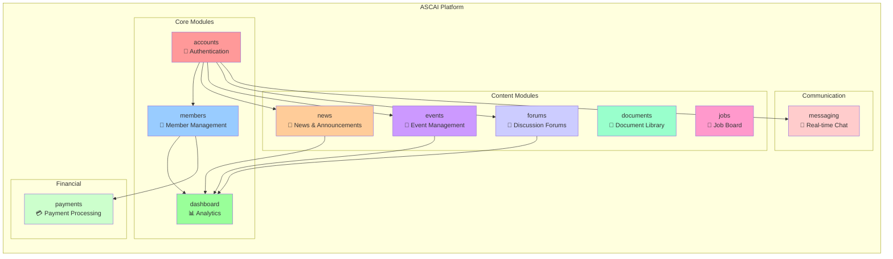

---

## 🔐 User Registration & Authentication Flow

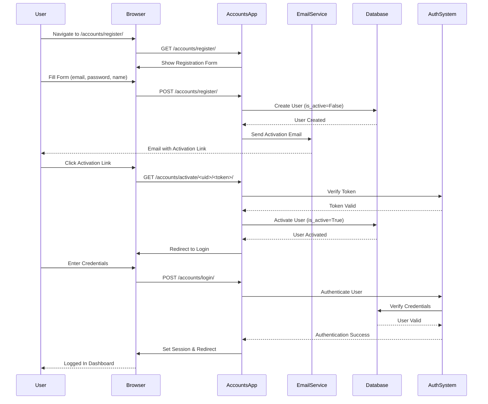

---

## 👤 Member Management Flow

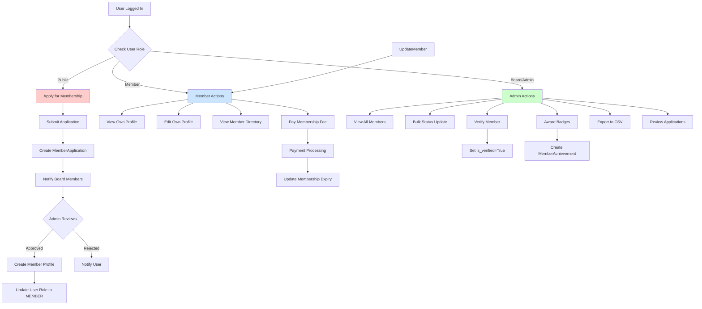

---

## 📅 Event Management Flow

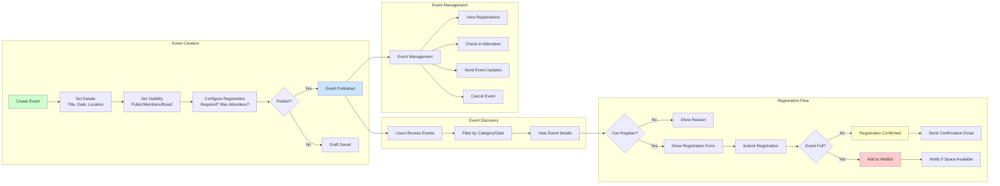

---

## 📰 Content Management Flow

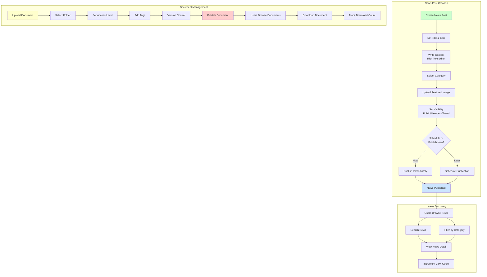

---

## 💳 Payment & Subscription Flow

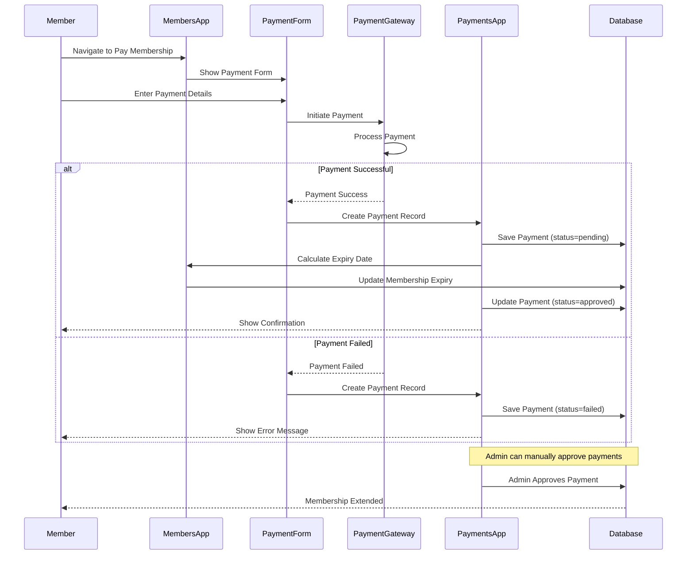

---

## 💬 Real-time Messaging Architecture

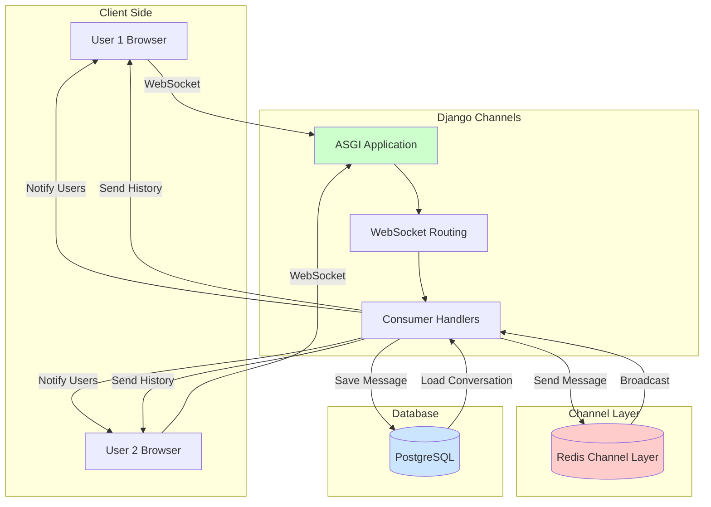

---

## 🔗 URL Routing Structure

```mermaid
graph TD
    Root[/] --> Dashboard[dashboard/]
    Root --> Accounts[accounts/]
    Root --> Members[members/]
    Root --> News[news/]
    Root --> Events[events/]
    Root --> Documents[documents/]
    Root --> Jobs[jobs/]
    Root --> Forums[forums/]
    Root --> Messaging[messaging/]
    Root --> Admin[admin/]
    
    Accounts --> Register[register/]
    Accounts --> Login[login/]
    Accounts --> Logout[logout/]
    Accounts --> Profile[profile/]
    Accounts --> Activate[activate/]
    
    Members --> Directory[directory/]
    Members --> MemberProfile[profile/]
    Members --> Apply[apply/]
    Members --> Pay[pay/]
    Members --> Export[export/csv/]
    
    News --> NewsList[list/]
    News --> NewsDetail[detail/]
    News --> NewsCreate[create/]
    News --> NewsEdit[edit/]
    
    Events --> EventList[list/]
    Events --> EventDetail[detail/]
    Events --> EventCreate[create/]
    Events --> EventRegister[register/]
    
    Documents --> DocList[list/]
    Documents --> DocDetail[detail/]
    Documents --> DocUpload[upload/]
    Documents --> DocDownload[download/]
    
    Jobs --> JobList[list/]
    Jobs --> JobDetail[detail/]
    Jobs --> JobApply[apply/]
    
    Forums --> ForumList[list/]
    Forums --> ThreadDetail[thread/]
    Forums --> ThreadCreate[create/]
    
    Messaging --> Conversations[conversations/]
    Messaging --> Chat[chat/]
    
    Dashboard --> Home[home/]
    Dashboard --> AdminDash[admin/]
    
    style Root fill:#ff9999
    style Accounts fill:#99ccff
    style Members fill:#99ff99
    style News fill:#ffcc99
    style Events fill:#cc99ff
```

---

## 🔄 Data Flow Diagrams

### News Publication Data Flow

```mermaid
flowchart LR
    Author[Author<br/>Board/Admin] --> Create[Create News Post]
    Create --> Validate[Validate Input]
    Validate --> SaveDB[(Save to Database)]
    SaveDB --> Process[Process Image]
    Process --> StoreMedia[Store in Media Folder]
    StoreMedia --> Cache[Update Cache]
    Cache --> Publish[Publish to Site]
    Publish --> Users[Users See News]
    
    Users --> View[View News]
    View --> Increment[Increment View Count]
    Increment --> UpdateDB[(Update Database)]
    
    style Author fill:#ccffcc
    style SaveDB fill:#cce5ff
    style Users fill:#ffffcc
```

### Member Search & Filter Flow

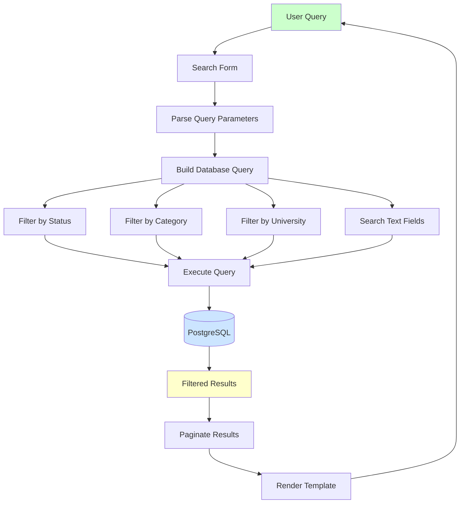

---

## 📊 Module Dependency Graph

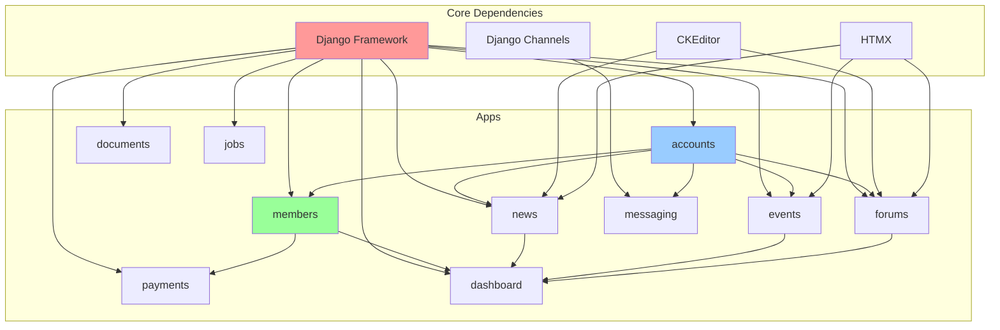

---

## 🎯 Key Features Summary

### ✅ Implemented Features

1. **Authentication System**
   - Email-based registration
   - Email verification
   - Password management
   - Role-based access control

2. **Member Management**
   - Member directory with search/filter
   - Member profiles
   - Membership applications
   - Badge system
   - Payment tracking

3. **Content Management**
   - News posts with categories
   - Document library with folders
   - Rich text editing
   - Media uploads

4. **Event Management**
   - Event creation and scheduling
   - Registration system
   - RSVP tracking
   - Waitlist management

5. **Communication**
   - Real-time messaging
   - Discussion forums
   - Notifications

6. **Job Board**
   - Job postings
   - Application management
   - Resume uploads

### 🔄 In Progress

- Enhanced dashboard analytics
- Email notification system
- Advanced search features

### 📅 Planned

- Payment gateway integration (Stripe/PayPal)
- Advanced reporting
- Mobile app API
- Automated workflows

---

## 🛠️ Technology Stack

- **Backend**: Django 5.1+
- **Database**: PostgreSQL
- **Cache/Channels**: Redis
- **Frontend**: Django Templates + HTMX
- **Real-time**: Django Channels + WebSockets
- **Rich Text**: CKEditor
- **Internationalization**: Django i18n (EN, FR, IT)

---

## 📝 Notes

This visual documentation is designed to help developers, stakeholders, and new team members understand:

1. **System Architecture**: How components interact
2. **Data Models**: Relationships between entities
3. **User Flows**: How users interact with the system
4. **Permissions**: Role-based access control
5. **Module Structure**: App organization and dependencies

For detailed code documentation, refer to:
- Individual app README files
- Model docstrings
- View comments
- Code comments

---

**Last Updated**: 2024  
**Platform Version**: 0.35  
**Status**: Foundation Complete ✅

